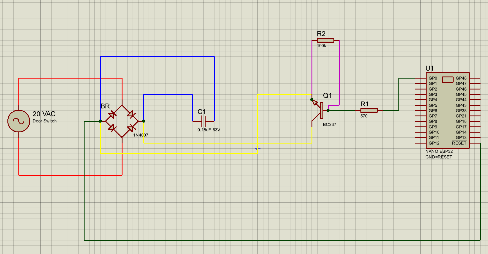
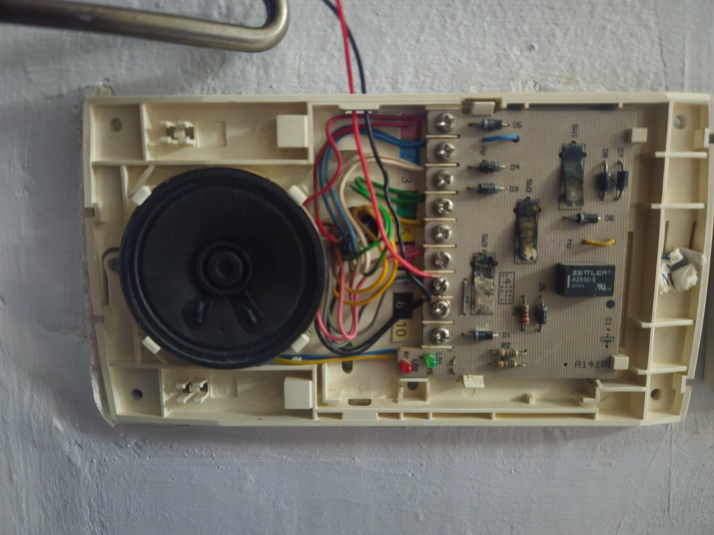
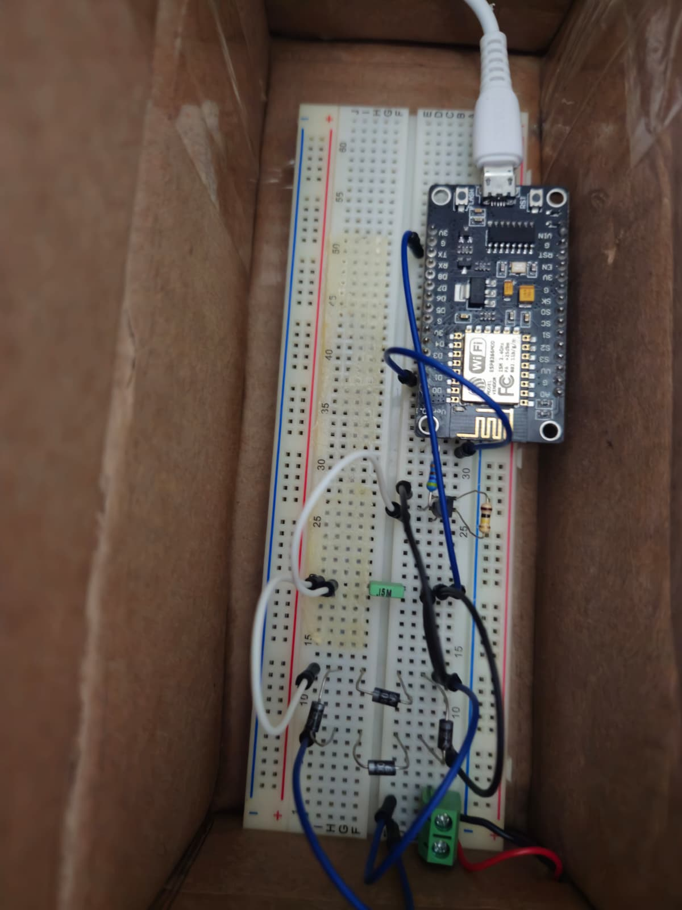

# Smart Door Unlocker (NodeMCU + Intercom Hack)

This project lets a **NodeMCU (ESP8266)** trigger the **intercom door-unlock** by electronically “pressing” the SW3 switch. It uses only **diodes + a transistor** (no relays/PhotoMOS) and keeps the original button working.

---

## Overview

* Intercom provides **~20 VAC** to SW3.
* A **bridge rectifier** converts it to DC.
* A **BJT (BC237 or 2N2222)** shorts the bridge **+ ↔ –** when a GPIO goes HIGH, simulating a press.
* A **150 nF / 63 V** cap across the bridge filters noise.

---

## Features

* Remote unlock from NodeMCU GPIO
* Original switch still works
* Parts are cheap & common
* Handles noisy low-voltage AC safely
* Simple timed press logic

---

## Hardware

### Parts

| Part                  | Value / Model               | Notes            |
| --------------------- | --------------------------- | ---------------- |
| NodeMCU (ESP8266)     | —                           | 3.3 V logic      |
| NPN transistor        | **BC237** or **2N2222**     | Switch element   |
| Base resistor         | **570 Ω or 1 kΩ**           | GPIO → Base      |
| Pull-down             | **100 kΩ**                  | Base → Emitter   |
| Bridge rectifier      | **4× 1N4007**               | AC → DC          |
| Filter cap            | **150 nF 63 V**             | Bridge **+ ↔ –** |
| (Optional) AC snubber | **100 Ω + 100 nF** (series) | Across SW3 pads  |

### Connections

#### Proteus

#### Door Controller

#### Circuit

---

## Electrical Notes

* The 20 VAC line is from a **transformer-isolated** intercom supply (typical 12–24 VAC).
  Sharing **bridge – ↔ NodeMCU GND** is OK in this context.
* Keep the **150 nF / 63 V** across bridge **+ ↔ –**.
  If it ever gets warm, add an **AC snubber** (100 Ω in series with 100 nF/63 V) across the two SW3 pads.

---

## Network Notes

* This project focuses primarily on hardware and embedded control, not on full internet connectivity.

* Because many Turkish ISPs lock down router configurations, this system communicates over local LAN broadcast rather than direct port forwarding or cloud services.

* You can adapt the firmware to your own network environment — for example, MQTT, HTTP requests, or WebSockets — depending on your setup and access to your network router.

---

## Troubleshooting

| Symptom                  | Cause                                  | Fix                                                                       |
| ------------------------ | -------------------------------------- | ------------------------------------------------------------------------- |
| Clicks but no unlock     | Press too short or marginal saturation | Increase `PRESS_MS` to 900–1000 ms; use **2N2222** or lower base resistor |
| Second press weaker      | Controller re-arm delay                | Increase `GAP_MS` to 3500–4000 ms                                         |
| Cap burned across bridge | Inductive spike                        | Add AC snubber 100 Ω + 100 nF in series across SW3 pads                   |
| ESP glitches/resets      | Noise/ground path                      | Shorten wiring, keep bridge loop tight, power ESP from isolated USB       |

---

## Disclaimer

This project assumes your intercom/door strike supply is **low-voltage and transformer-isolated (≤ 24 VAC)**.
Do **not** connect to mains or non-isolated sources. Build and use at your own risk.
